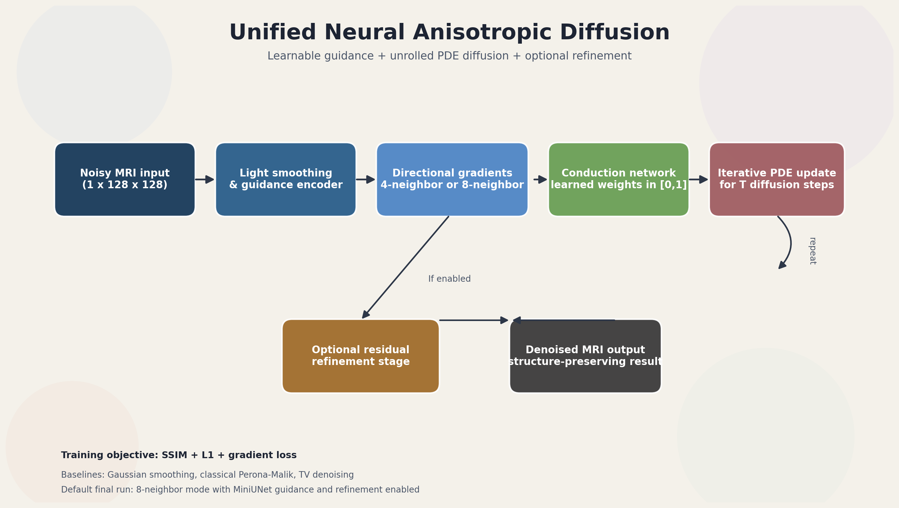

# Neural Anisotropic Diffusion

This repository contains a unified, working version of a learned Perona-Malik style image denoiser for brain MRI slices. The model unrolls a PDE-style diffusion process and predicts spatially varying conduction weights with a neural network so it can smooth noise while trying to preserve edges.

**Best final neural PDE result:** `24.853 dB` PSNR / `0.719` SSIM on the held-out Br35H test split.

**Gain over best classical baseline:** `+4.460 dB` PSNR / `+0.134` SSIM over Non-Local Means.

**Best overall final denoiser:** a plain U-Net baseline reached `25.875 dB` PSNR / `0.759` SSIM.

Full result notes are in [`REPORT.md`](https://github.com/tushar-nayak/neural-anisotropic-diffusion/blob/extended/REPORT.md).

## Project Summary

Medical image denoising is not just a smoothing problem. In brain MRI, useful denoising should suppress noise while preserving anatomical boundaries, lesion margins, and tissue structure. Classical filters such as Gaussian smoothing can improve visual smoothness, but they often blur the same edges that matter downstream.

This project explores a learned anisotropic diffusion model for MRI denoising. The model keeps the structure of a Perona-Malik style diffusion process, but replaces the fixed hand-designed conduction function with learned spatially varying conduction weights. The result is a hybrid model: it has the inductive bias of a PDE-based denoiser while still learning from data.

The current extended branch includes:

- a unified PyTorch training and evaluation script
- 4-neighbor and 8-neighbor diffusion modes
- optional multi-scale diffusion
- optional MiniUNet guidance features
- optional residual refinement
- uncertainty-map inference via Monte Carlo dropout
- classical and neural comparison baselines
- edge-preservation metrics
- self-supervised blind-spot training mode
- optional downstream segmentation evaluation when masks are available
- eval-only, noise-sweep, ablation, and config-driven experiment modes
- reproducibility scripts for extended evaluation, noise sweeps, ablations, and U-Net baseline runs

## New Research Modes

The current `main.py` and Gradio demo support a second layer of experimentation on top of the original denoising pipeline:

- `--use-multiscale` enables a coarse-to-fine diffusion update path.
- `--dropout-p` activates stochastic dropout, which the demo uses for uncertainty maps.
- `--self-supervised` switches training to blind-spot corruption instead of clean targets.
- `--run-segmentation-eval` trains and evaluates a small downstream segmentation head when masks are available.
- The Gradio demo visualizes the denoised output, step-wise diffusion trace, conduction heatmaps, and uncertainty maps.

BR35H itself does not ship pixel-level masks, so downstream segmentation evaluation only runs if you provide a compatible mask directory for the same image set.

## Method

The model starts from a noisy MRI slice and repeatedly applies a learned diffusion update. At each unrolled step, local image gradients are computed across either 4 or 8 neighboring directions. A small neural conduction network predicts how much diffusion should happen along each direction, using both local gradients and optional guidance features.

### Architecture Diagram



The training objective combines:

- SSIM loss for structural similarity
- L1 loss for pixel-level fidelity
- gradient loss for edge preservation

The default loss is:

```text
SSIM + L1 + 0.1 * gradient_loss
```

This is intended to reward denoising without fully washing out anatomical detail.

## Dataset And Evaluation

The experiments use the Br35H brain tumor MRI dataset downloaded into the local `brain_tumor_dataset/` directory. The labels in the dataset are used only for stratified splitting and qualitative grouping. This project treats the images as a denoising benchmark, not as a tumor classifier.

The committed extended result uses:

- `3000` total images
- `2100 / 450 / 450` train, validation, and test split
- Rician-style synthetic corruption during training
- held-out test evaluation against classical denoisers
- PSNR and SSIM as image-quality metrics

The final comparison is saved in [`results_final/unified_comparison_table.csv`](https://github.com/tushar-nayak/neural-anisotropic-diffusion/blob/extended/results_final/unified_comparison_table.csv).

## Results

The final held-out test evaluation produced:

| Method | PSNR (dB) | SSIM | Edge MSE |
| --- | ---: | ---: | ---: |
| Noisy Input | 17.711 | 0.425 | 0.194 |
| Gaussian Smoothing | 19.011 | 0.552 | 0.185 |
| Median Filter | 19.538 | 0.521 | 0.136 |
| Bilateral Filter | 18.955 | 0.463 | 0.136 |
| Non-Local Means | 20.393 | 0.585 | 0.087 |
| Wavelet Denoising | 19.519 | 0.530 | 0.106 |
| Skimage TV | 19.482 | 0.570 | 0.134 |
| Curvature Flow (16 iter) | 19.985 | 0.560 | 0.113 |
| Classical PM (16 iter) | 19.635 | 0.539 | 0.106 |
| Unified Neural PDE (Ours) | 24.853 | 0.719 | 0.056 |

The learned diffusion model is the strongest PDE-style method and substantially outperforms the classical baselines. Relative to the best classical baseline in this table, Non-Local Means, the unified neural PDE improves:

| Comparison | PSNR Gain | SSIM Gain |
| --- | ---: | ---: |
| Ours vs Non-Local Means | +4.460 dB | +0.134 |

The final deep baseline comparison is also included. A plain U-Net denoiser trained on the same noisy/clean setup reached `25.875 dB` PSNR and `0.759` SSIM, outperforming the learned PDE model. The honest conclusion is that the learned diffusion approach clearly beats hand-designed denoisers, while a generic supervised U-Net remains the strongest neural baseline in the final run.

## Outputs And Figures

The final result artifacts are committed in [`results_final/`](https://github.com/tushar-nayak/neural-anisotropic-diffusion/tree/extended/results_final):

- [`unified_comparison_table.csv`](https://github.com/tushar-nayak/neural-anisotropic-diffusion/blob/extended/results_final/unified_comparison_table.csv): quantitative comparison table
- [`unified_qualitative_results.png`](https://github.com/tushar-nayak/neural-anisotropic-diffusion/blob/extended/results_final/unified_qualitative_results.png): qualitative denoising examples
- [`unified_full_comparison_grid.png`](https://github.com/tushar-nayak/neural-anisotropic-diffusion/blob/extended/results_final/unified_full_comparison_grid.png): multi-method qualitative comparison
- [`unified_metric_bars.png`](https://github.com/tushar-nayak/neural-anisotropic-diffusion/blob/extended/results_final/unified_metric_bars.png): PSNR and SSIM bar chart
- [`run_metadata.json`](https://github.com/tushar-nayak/neural-anisotropic-diffusion/blob/extended/results_final/run_metadata.json): run metadata and reproducibility information

Additional completed experiment folders:

- [`results_noise_sweep/`](https://github.com/tushar-nayak/neural-anisotropic-diffusion/tree/extended/results_noise_sweep): fixed-noise robustness sweep
- [`results_unet_baseline/`](https://github.com/tushar-nayak/neural-anisotropic-diffusion/tree/extended/results_unet_baseline): plain U-Net baseline comparison
- [`results_ablation/`](https://github.com/tushar-nayak/neural-anisotropic-diffusion/tree/extended/results_ablation): architecture ablation suite

### Quantitative Comparison


### Full Comparison Grid


### Qualitative Denoising Examples


## What the unified script does

- Loads grayscale MRI slices from the local Br35H Kaggle download in `brain_tumor_dataset/`.
- Splits the data into stratified train, validation, and test sets.
- Synthesizes noise on the fly using Gaussian, Rician, speckle, or mixed corruption.
- Trains a learnable anisotropic diffusion model with SSIM + L1 + gradient loss.
- Optionally uses:
  - a 4-neighbor or 8-neighbor PDE update
  - a MiniUNet guidance encoder
  - a residual refinement stage
- Writes local outputs for:
  - training curves
  - qualitative examples
  - a comparison table against noisy input, Gaussian smoothing, median filtering, bilateral filtering, non-local means, wavelet denoising, classical Perona-Malik, curvature flow, and TV denoising

The main entry point is [`main.py`](https://github.com/tushar-nayak/neural-anisotropic-diffusion/blob/extended/main.py).

## Repository Layout

- [`main.py`](https://github.com/tushar-nayak/neural-anisotropic-diffusion/blob/extended/main.py): unified runnable version
- [`app.py`](https://github.com/tushar-nayak/neural-anisotropic-diffusion/blob/extended/app.py): Gradio demo with diffusion tracing
- [`Makefile`](https://github.com/tushar-nayak/neural-anisotropic-diffusion/blob/extended/Makefile): `run`, `smoke`, and `demo` targets
- [`requirements.txt`](https://github.com/tushar-nayak/neural-anisotropic-diffusion/blob/extended/requirements.txt): dependency list
- [`download_br35h_dataset.py`](https://github.com/tushar-nayak/neural-anisotropic-diffusion/blob/extended/download_br35h_dataset.py): downloads the Br35H Kaggle dataset into the repo-local `brain_tumor_dataset/` path
- [`REPORT.md`](https://github.com/tushar-nayak/neural-anisotropic-diffusion/blob/extended/REPORT.md): experiment summary and interpretation
- [`scripts/`](https://github.com/tushar-nayak/neural-anisotropic-diffusion/tree/extended/scripts): reproducibility commands for common experiments
- `brain_tumor_dataset/`: local Br35H MRI dataset, ignored by Git

## Requirements

- Python 3.8+
- PyTorch
- torchvision
- numpy
- pandas
- matplotlib
- scikit-learn
- Pillow
- scipy
- scikit-image

Optional:

- `pytorch_msssim` for the SSIM loss implementation

If `pytorch_msssim` is not installed, `main.py` falls back to a local Torch SSIM implementation.

## Usage

Run the default unified model:

```bash
python main.py
```

Or use the make target:

```bash
make run
```

Useful flags:

```bash
python main.py --neighbor-mode 4
python main.py --neighbor-mode 8
python main.py --noise-type gaussian
python main.py --noise-type rician
python main.py --iterations 16 --lambda-param 0.05
python main.py --epochs 300 --batch-size 8
python main.py --epochs 300 --results-dir results_300epochs --checkpoint-dir checkpoints_300epochs
python main.py --eval-only --checkpoint checkpoints_extended/unified_model.pth --results-dir results_eval
python main.py --eval-only --checkpoint checkpoints_extended/unified_model.pth --eval-limit 50 --results-dir results_quick_eval
python main.py --noise-sweep --noise-sweep-types gaussian,rician,speckle --noise-sweep-sigmas 0.05,0.10,0.15,0.20
python main.py --train-unet-baseline-epochs 50
python main.py --run-ablation-suite --ablation-epochs 20
python main.py --config configs/example.json
python main.py --no-refinement
python main.py --no-unet-guidance
python main.py --use-multiscale
python main.py --dropout-p 0.1
python main.py --self-supervised --mask-ratio 0.1 --mask-block-size 5
python main.py --run-segmentation-eval --segmentation-mask-dir path/to/masks
```

### Interactive Demo

Launch the Gradio app to upload an MRI slice, run the learned PDE denoiser, and inspect the diffusion trace, conduction heatmaps, and uncertainty maps:

```bash
make demo
```

Or run it directly:

```bash
python app.py --server-name 127.0.0.1 --server-port 7860
```

### Running Inference

You can run denoising on individual images using the `inference.py` script. It loads a trained checkpoint and saves a side-by-side comparison of the noisy input and the neural PDE output.

```bash
# Basic inference using the default extended checkpoint
python inference.py --image path/to/your/mri_slice.jpg

# Specify a custom checkpoint and output path
python inference.py \
  --image brain_tumor_dataset/no/no10.jpg \
  --checkpoint checkpoints/unified_model.pth \
  --output my_denoised_result.png
```

For a fast sanity check:

```bash
make smoke
```

Note: BR35H itself does not include pixel-level segmentation masks, so the downstream segmentation evaluation mode only runs if you provide a compatible mask directory for the same image set.

Download or refresh the Br35H dataset locally:

```bash
python download_br35h_dataset.py
```

Reproduce common experiment variants:

```bash
scripts/run_final_all.sh
scripts/run_extended_eval.sh
scripts/run_noise_sweep.sh
scripts/run_ablation_suite.sh
scripts/run_unet_baseline.sh
```

Default behavior:

- `neighbor-mode=8`
- `noise-type=rician`
- `iterations=16` for 8-neighbor mode
- `lambda-param=0.05` for 8-neighbor mode
- `iterations=10` for 4-neighbor mode
- `lambda-param=0.1` for 4-neighbor mode

## Outputs

The unified script writes these files locally when you run it:

- `results/unified_loss_curves.png`
- `results/unified_qualitative_results.png`
- `results/unified_comparison_table.csv`
- `results/unified_full_comparison_grid.png`
- `results/unified_metric_bars.png`
- `results/unified_noise_sweep.csv` when `--noise-sweep` is enabled
- `results/unified_ablation_suite.csv` when `--run-ablation-suite` is enabled
- `results/run_metadata.json`
- `checkpoints/unified_model.pth`

The comparison CSV reports mean and standard deviation for PSNR and SSIM, plus a Sobel-edge MSE metric for edge preservation. Lower edge MSE indicates closer agreement with the clean image's edge map. The metadata JSON records the command arguments, dataset split sizes, checkpoint path, git commit, Python/PyTorch versions, and GPU availability.

Optional experiment modes:

- `--eval-only` evaluates an existing checkpoint without retraining.
- `--eval-limit N` evaluates only the first `N` held-out test examples for fast checks.
- `--noise-sweep` evaluates robustness across fixed corruption types and noise levels.
- `--train-unet-baseline-epochs N` trains a plain U-Net denoising baseline and adds it to the comparison table.
- `--run-ablation-suite` trains common variants: full model, no MiniUNet guidance, no residual refinement, and 4-neighbor diffusion.
- `--config path/to/config.json` loads arguments from a JSON file using the same names as the command-line flags.

## Notes

- The dataset is treated as a denoising benchmark, not a classifier.
- The `no` and `yes` folder labels are used for stratified splitting and for labeling qualitative examples.
- The script is headless-safe and uses the Agg matplotlib backend, so it runs over SSH or in a non-GUI environment.
- The repository is intentionally cleaned to keep only the unified source, docs, and reproducibility files.
